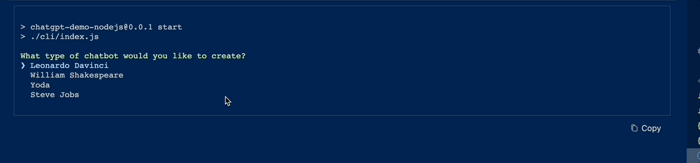

# Node.js ChatGPT Demo!

[](https://runme.dev/api/runme?repository=git%40github.com%3ALizzParody%2Fchatgpt-demo.git)

This project contains different demos using ChatGPT and showcaseS how to build powerful AI Workflows
using [minds](https://github.com/dosco/minds)



# Ensure you have a .env file with the OpenAI API Key

```bash { background=false interactive=true }
cp .env.example .env
```

## Ask ChatGPT as one of the following characters:

- Leonardo Davinci
- William Shakespeare
- Yoda
- Steve Jobs

Execute the following command to see it in action:

```bash { background=false interactive=true }
npm run start
```

## Analyze a customer support request using minds by automatically identifying:

- Product Name
- Issue description
- Issue summary
- Payment method

```bash { background=true interactive=true }
npm run support-demo
```
